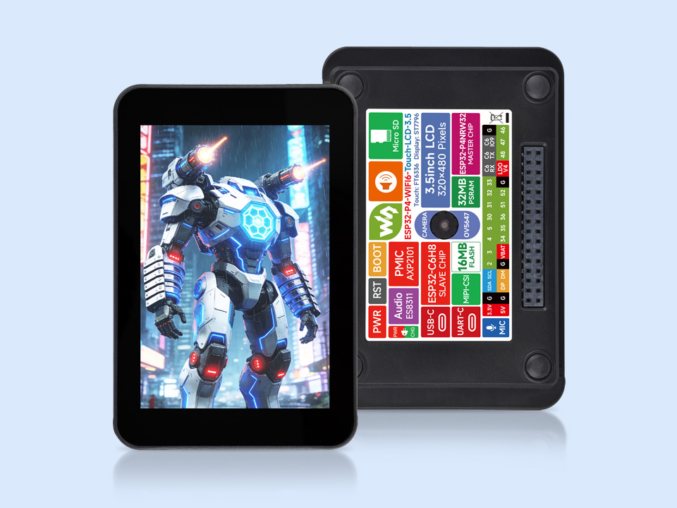

  <h1>ESP32-P4-WIFI6-Touch-LCD-3.5</h1>
  
<strong>ESP32-P4 3.5-inch 320 × 480 SPI LCD smart vision development board</strong>

  

    
    
    
  

  

    <a href="README_ZH.md">中文</a> ·
    <a href="https://www.waveshare.com/esp32-p4-wifi6-touch-lcd-3.5.htm">🌐 Product Page</a> ·
    <a href="https://docs.waveshare.com/ESP32-P4-WIFI6-Touch-LCD-3.5">📚 Documentation</a> ·
    <a href="#-firmware">📦 Firmware</a> ·
    <a href="examples/esp-idf/">🧩 ESP-IDF Examples</a> ·
    <a href="schematic/ESP32-P4-WIFI6-Touch-LCD-3.5-schematic.pdf">🧾 Schematic</a>
  

  

---

## ✨ Overview

This repository provides first-party ESP-IDF examples, a bundled
firmware image, and the schematic for the Waveshare
ESP32-P4-WIFI6-Touch-LCD-3.5.

The board combines an ESP32-P4 application processor with an ESP32-C6 wireless
coprocessor, a 3.5-inch capacitive touch display, camera, audio, storage, and
power-management peripherals. It is designed for smart displays, voice and
vision interfaces, edge AI, and other interactive embedded applications.

## 🖥️ Hardware Overview

| Feature | Device / interface |
| --- | --- |
| Main processor | ESP32-P4NRW32, high-performance dual-core plus low-power single-core RISC-V |
| Memory | 32 MB in-package PSRAM and 16 MB external NOR flash |
| Wireless | ESP32-C6FH8 over SDIO, providing 2.4 GHz Wi-Fi 6 and Bluetooth 5 LE |
| Display | 3.5-inch 320 × 480 IPS LCD using the ST7796 controller over SPI |
| Touch | FT6336 capacitive touch controller over I2C |
| Camera | 5 MP OV5647 camera over MIPI-CSI |
| Audio | ES8311 codec, onboard microphone, and 8 Ω / 2 W speaker |
| Power | AXP2101 power management and a 3.7 V lithium battery connector |
| Storage | MicroSD card slot using SDIO 3.0 |
| USB | USB-UART Type-C and USB 2.0 High-Speed OTG Type-C |
| Hardware files | [Schematic](schematic/ESP32-P4-WIFI6-Touch-LCD-3.5-schematic.pdf) |

> [!NOTE]
> Wireless connectivity is provided by the onboard ESP32-C6 coprocessor; the
> ESP32-P4 itself does not contain a Wi-Fi or Bluetooth radio.

## 🚀 Getting Started

1. Read the official [product documentation](https://docs.waveshare.com/ESP32-P4-WIFI6-Touch-LCD-3.5).
2. Install the ESP-IDF version required by the example you want to use.
3. Open a project under [`examples/esp-idf/`](examples/esp-idf/) and review its
   configuration files.
4. Set the target to `esp32p4`, then configure, build, flash, and monitor the
   selected project with ESP-IDF.

The canonical example path is now `examples/esp-idf/`. If an older bookmark or
automation still uses `example/ESP-IDF/`, update it before selecting a project;
the legacy [`example/`](example/) directory contains migration notes only.

The Wi-Fi example communicates through the ESP32-C6 coprocessor. Keep the host
components and coprocessor firmware compatible when changing its dependencies.

## 🧪 ESP-IDF Examples

| Example | Focus |
| --- | --- |
| [01_HowToCreateProject](examples/esp-idf/01_HowToCreateProject/) | Minimal ESP-IDF project structure |
| [02_HelloWorld](examples/esp-idf/02_HelloWorld/) | Basic application and system information |
| [03_i2c_tools](examples/esp-idf/03_i2c_tools/) | I2C bus tools and device discovery |
| [04_wifistation](examples/esp-idf/04_wifistation/) | Wi-Fi station through the ESP32-C6 coprocessor |
| [05_sdmmc](examples/esp-idf/05_sdmmc/) | MicroSD card access |
| [06_I2SCodec](examples/esp-idf/06_I2SCodec/) | ES8311 audio input and output |
| [07_Displaycolorbar](examples/esp-idf/07_Displaycolorbar/) | LCD bring-up and color bars |
| [08_lvgl_demo_v9](examples/esp-idf/08_lvgl_demo_v9/) | LVGL 9 display and touch demo |
| [09_video_lcd_display](examples/esp-idf/09_video_lcd_display/) | OV5647 camera video on the LCD |
| [10_mp4_player](examples/esp-idf/10_mp4_player/) | MP4 playback with video and audio |
| [11_esp_brookesia_phone](examples/esp-idf/11_esp_brookesia_phone/) | ESP-Brookesia phone-style UI |
| [12_esp32-p4-eye](examples/esp-idf/12_esp32-p4-eye/) | Camera, album, and on-device vision demo |

Arduino sketches are not currently included in this repository.

## ✅ Continuous Integration

The [ESP-IDF Examples workflow](.github/workflows/esp-idf.yml) dynamically
discovers every direct project under `examples/esp-idf/` and classifies the
complete Git diff. Project-local source changes build only the affected project;
shared, workflow, or unknown build inputs select all projects. Documentation and
governance changes still report the stable CI gate but skip the firmware matrix.
Every selected project is compiled for `esp32p4` with ESP-IDF v5.5.5 and v6.0.2.

Every successful matrix entry uploads a flashable artifact derived from that
project's `flasher_args.json`. The checked-in prebuilt image under `firmware/`
is intentionally excluded. See the [CI guide](docs/ci.md) for diff routing,
project selection, version updates, artifact contents, required-check behavior,
and validation boundaries.

## 📦 Firmware 

[`firmware/ESP32-P4-WiFi6-LCD-3in5.bin`](firmware/ESP32-P4-WiFi6-LCD-3in5.bin)
is a checked-in prebuilt firmware image, not an ESP-IDF source project or a CI
build output. Follow the official product documentation for the supported
flashing procedure.

Source and build instructions for this prebuilt image are not included in this
repository yet and may be added in a later update. Source CI never repackages or
re-uploads this file; any replacement requires separate release provenance and
hardware-validation evidence.

## 🗂️ Repository Layout

| Path | Purpose |
| --- | --- |
| [`examples/esp-idf/`](examples/esp-idf/) | First-party ESP-IDF projects |
| [`firmware/`](firmware/) | Prebuilt firmware image |
| [`schematic/`](schematic/) | Product schematic |
| [`assets/`](assets/) | Product images used by the documentation |
| [`example/`](example/) | Compatibility notice for the former example path |
| [`docs/`](docs/) | CI, component, and maintenance policy |
| [`.github/workflows/`](.github/workflows/) | ESP-IDF builds and documentation validation |
| [`scripts/`](scripts/) | CI discovery, artifact packaging, and documentation validation helpers |

## 📚 Documentation and Support

- [Product Page](https://www.waveshare.com/esp32-p4-wifi6-touch-lcd-3.5.htm)
- [Product Documentation](https://docs.waveshare.com/ESP32-P4-WIFI6-Touch-LCD-3.5)
- [Schematic](schematic/ESP32-P4-WIFI6-Touch-LCD-3.5-schematic.pdf)
- [CI and artifact policy](docs/ci.md)
- [Component maintenance policy](docs/components.md)
- [Contributing guide](CONTRIBUTING.md)
- [Support guide](SUPPORT.md)
- [Open an Issue](https://github.com/waveshareteam/ESP32-P4-WIFI6-Touch-LCD-3.5/issues/new)

When reporting a problem, include the example path, ESP-IDF version,
reproduction steps, expected behavior, actual behavior, and relevant serial
logs. For product support, also provide the order number when contacting
Waveshare.

A green Actions run is compile-and-package evidence, not board-level proof.
Display, touch, camera, audio, storage, USB, power, and ESP32-C6 hosted-wireless
behavior must still be validated on the target hardware.

## 📄 License

This repository is licensed under the Apache License 2.0. See
[LICENSE](LICENSE).

Bundled third-party components remain subject to their respective licenses.
